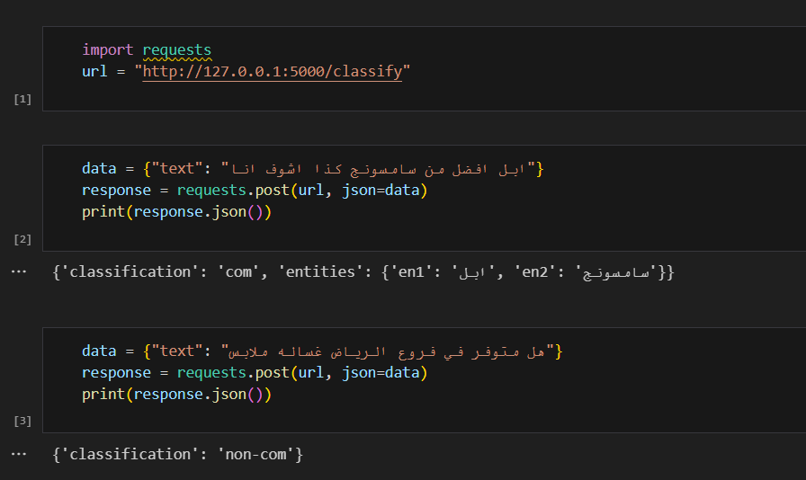

# Arabic Tweet Comparison Classifier

This repository contains a complete pipeline for analyzing Arabic tweets written in informal language. The project performs **text classification** to determine whether a tweet contains a comparison, and if so, utilizes **named entity recognition (NER)** to extract the entities being compared.

## 📝 Project Objective

To build a robust machine learning and deep learning pipeline that:
1. Preprocesses Arabic tweets (handling informal language and normalizing text).
2. Classifies tweets as **comparative** or **non-comparative**.
3. Extracts comparison entities (e.g., "ايفون" vs. "سامسونج") if a tweet is comparative.

---

## 🛠 Features

- **Text Classification Models:**
  - BiLSTM
  - CNN
  - CNN+LSTM (chosen model)
  - AraBERT
  - AraBERT+LSTM
- **Named Entity Recognition (NER) Models:**
  - AraBERT
  - AraBERT+LSTM (chosen model)
- **Deployment:**
  - Flask API with routes to classify tweets and extract entities.
  - Ready-to-deploy models.

---

## 🔧 Installation and Usage

### Clone the Repository
```bash
git clone https://github.com/AhmedNabil03/arabic-tweet-comparison-classifier.git
```
### Run the APP
```bash
cd arabic-tweet-comparison-classifier
cd flask_app
python app.py
```
### Access the API at 
http://127.0.0.1:5000.

---

### 🔑 Deployment Files
The Flask app depends on pre-trained models stored as `.zip` files. These files include the trained weights and tokenizers:

1. **Classification Model (`deployment_files_c.zip`)**:
   - Includes the tokenizer, embedding matrix, and classification model for determining if a tweet contains a comparison.
   - Train this model using the chosen model of `classification_notebooks`.

2. **NER Model (`deployment_files_n.zip`)**:
   - Includes the tokenizer and model weights for extracting comparison entities.
   - Train this model using the chosen model of `ner_notebooks`.

> **Note:** These files are not uploaded to GitHub due to size constraints. Train the models and save them locally in the `flask_app/` directory.

--- 

## 🔧 Usage Example



---

## 🔧 Repository Structure
```bash
Arabic-Tweet-Comparison-Classifier/
│
├── preprocessing_notebooks/       # Jupyter notebooks for preprocessing
│   ├── data_preprocessing.ipynb
│   └── tfidf_ml.ipynb
│ 
├── classification_notebooks/      # Jupyter notebooks for classification
│   ├── 1_bilstm.ipynb
│   ├── 2_cnn.ipynb
│   ├── 3_cnn_lstm.ipynb
│   ├── 4_arabert.ipynb
│   └── 5_arabert_lstm.ipynb
│
├── ner_notebooks/                 # Jupyter notebooks for NER
│   ├── 1_arabert.ipynb
│   └── 2_arabert_lstm.ipynb
│
├── flask_app/                     # Flask application folder
│   ├── app.py                     # Flask main app
│   ├── flask_workflow.py          # Preparing for Flask app
│   ├── test.ipynb                 # Testing the Flask app
│   ├── # deployment_files_c.zip     # Pretrained Model for Classification >> train the model then put it here
│   └── # deployment_files_n.zip     # Pretrained Model for NER >> train the model then put it here
│
├── test_example.png
└── README.md                      # Main README for the repository
```
